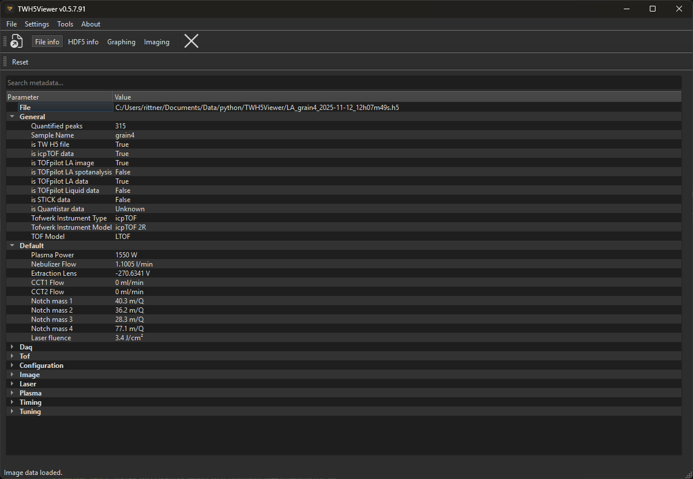
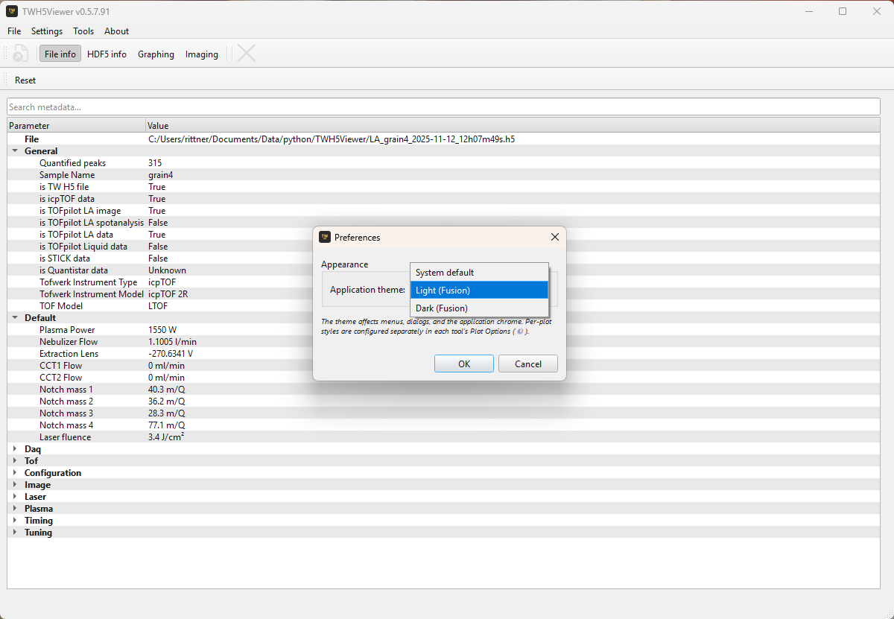
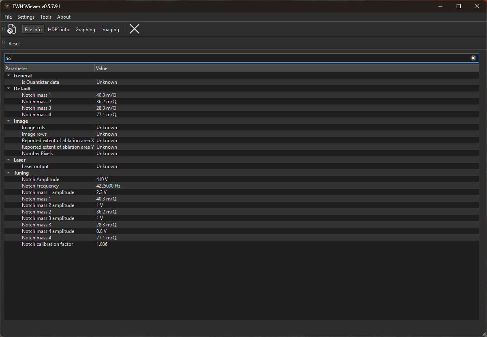
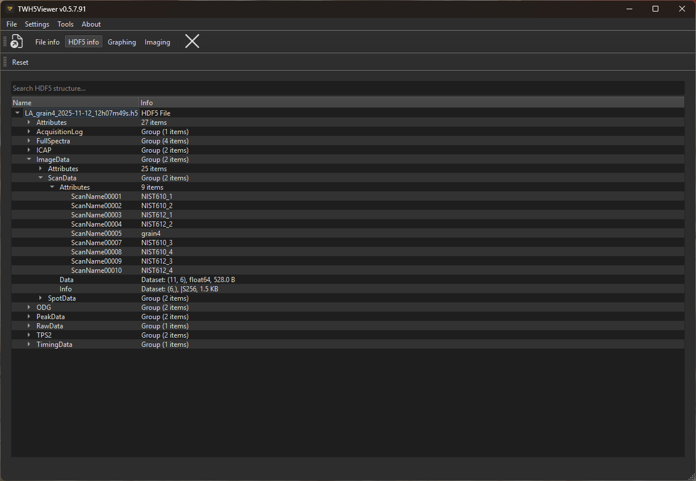
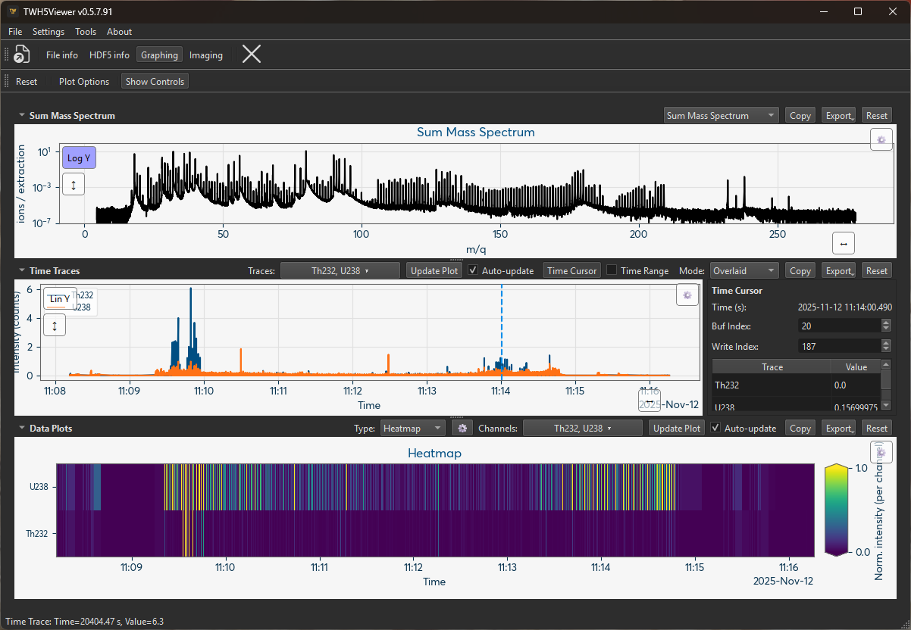
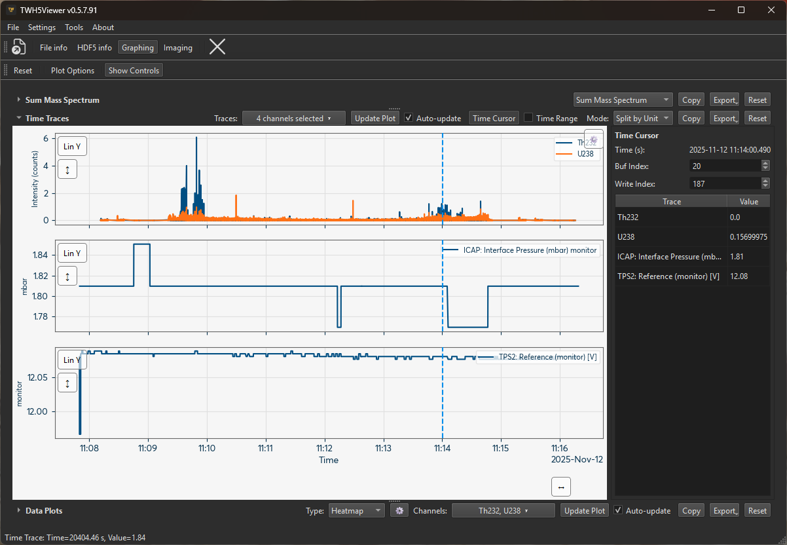
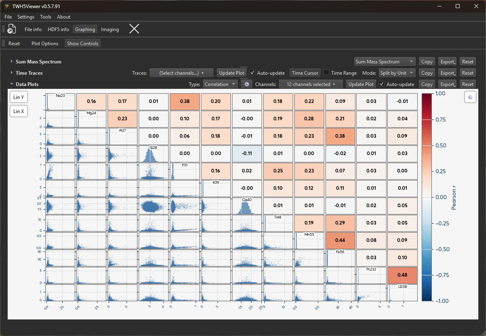
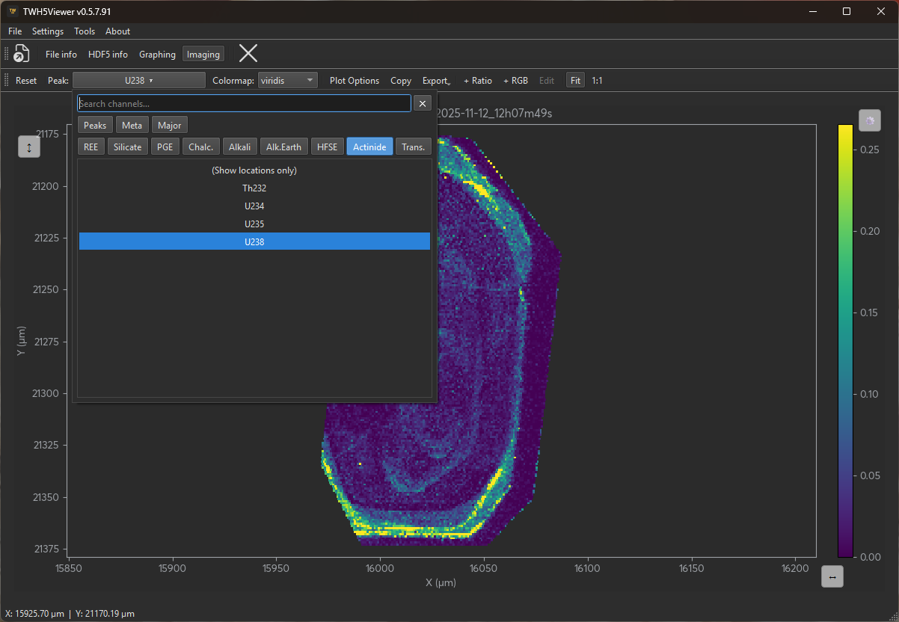
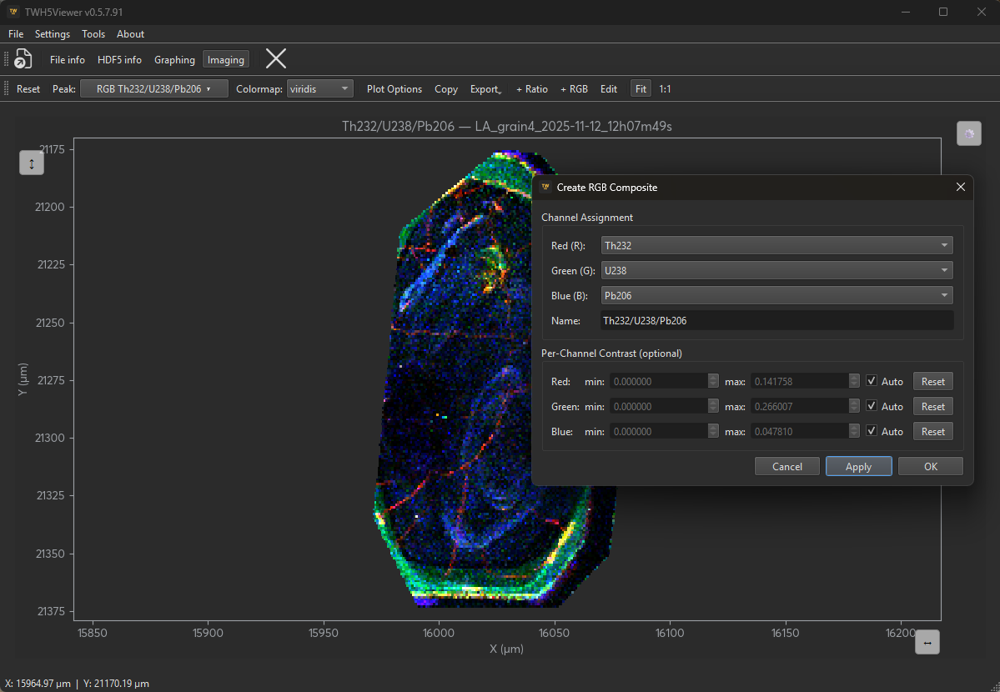

# Usage Guide

## Starting the Application

Run the Windows `.exe` file. If a data file is passed as a command-line argument the application opens it automatically on startup; you can also drop a `.h5` file onto the application window at any time.

To open a file from within the application use **File → Open…** or the keyboard shortcut **Ctrl+O**.

---

## Interface Overview

The application window consists of a **menu bar**, a **main toolbar**, and a **central panel**. The main toolbar contains four tool-switching buttons — *File Info*, *HDF5 Info*, *Graphing*, and *Imaging* — each of which replaces the central panel with the corresponding tool view and activates that tool's own context toolbar.

### Tool-switching buttons

| Button | Keyboard | What it shows |
|---|---|---|
| **File Info** | — | Parsed metadata tree grouped by category |
| **HDF5 Info** | — | Raw HDF5 file hierarchy (groups, datasets, attributes) |
| **Graphing** | — | Mass spectrum, time traces, and data plots |
| **Imaging** | — | Laser-ablation element map (LA files only) |

The Graphing and Imaging buttons are greyed out automatically when the loaded file does not contain the corresponding data type.

---

## Keyboard Shortcuts

| Shortcut | Action |
|---|---|
| **Ctrl+O** | Open file |
| **Ctrl+W** | Close file |
| **F1** | Open online documentation in system browser |

---

## Preferences

Open **Settings → Preferences** to configure application-wide options.

### Application theme

Choose between three colour themes that apply to all menus, dialogs, toolbars, and window chrome:

| Theme | Description |
|---|---|
| **System default** | Follows the OS appearance (light or dark) |
| **Light (Fusion)** | Light Fusion style, independent of the OS setting |
| **Dark (Fusion)** | Dark Fusion style, independent of the OS setting |

The theme is applied live as you move through the combo — clicking **Cancel** reverts the preview. The choice is saved for future sessions.

!!! note
    Per-plot styles (background colour, grid lines, colour maps) are configured separately in each tool's **Plot Options (⚙)** menu and are independent of the application theme.

---

## Tooltips

All interactive controls — toolbar buttons, channel selectors, plot-type dropdowns, export buttons, search boxes, and the preferences theme selector — have descriptive tooltips. Hover over any control for a moment to see what it does.

---

## Tools

### File Info

The **File Info** tool shows a parsed, grouped metadata tree populated from the loaded HDF5 file. Parameters are organised into named sections (e.g. *General*, *Image*, *Laser*, *Configuration*) with long descriptive names, smart value formatting (units appended, floats trimmed), and per-parameter tooltips where available.

The file path is always shown as the first row. Groups most relevant to the detected file type are expanded automatically on load; your manual expand/collapse choices are saved and restored on the next file open.

#### Searching

A search box above the tree filters parameters in real time. Groups are auto-expanded when they contain matches; clearing the search restores the previous expansion state.

#### Context Menu

Right-clicking any item opens a context-sensitive menu:

| Click target | Available actions |
|---|---|
| File path row | **Copy file path** |
| Group header | **Copy group values** (all parameters as tab-separated text), **Export group…**, **Export all metadata…** |
| Leaf parameter | **Copy value**, **Copy parameter name**, **Export group…**, **Export all metadata…** |
| Background | **Export all metadata…** |

#### Metadata Export

"Export group…" and "Export all metadata…" open a Save dialog with five format options:

| Format | Output |
|---|---|
| **CSV** | `# File: <filename>` comment on line 1. Columns: Group, Parameter, Value. A group-label row introduces each section. |
| **JSON** | `{"file": "<filename>", "groups": {"GroupName": [{"parameter": …, "value": …}, …], …}}` |
| **HTML** | Self-contained styled page. Filename as `<h1>`; each group as an `<h2>` heading followed by a two-column table. |
| **PDF** | Matplotlib-rendered table. Bold filename title; light-blue group header rows; alternating white/light-grey data rows. Height calculated from row count. |
| **PNG** | Same as PDF, saved as a raster image at 150 dpi. |

---

### HDF5 Structure Browser

The **HDF5 Info** tool shows the raw internal HDF5 file hierarchy. Every group, dataset (shape, data type, and size), and attribute is listed exactly as stored in the file — useful for low-level inspection or for locating dataset paths before writing custom analysis scripts.

#### Searching

A search box above the tree recursively filters groups, datasets, and attributes by name or info text. Matching items and all their ancestors are shown and auto-expanded; clearing the search collapses the tree back to the top-level root.

---

### Graphing Tool

The **Graphing Tool** provides three stacked, resizable panels: *Sum Mass Spectrum* (top), *Time Traces* (middle), and *Data Plots* (bottom). Each panel can be collapsed or expanded independently with its header toggle button. The main **Plot Options** toolbar button opens a dialog with global plot style settings.

#### Sum Mass Spectrum

The spectrum panel shows intensity vs. mass-to-charge ratio. Use the **Type** dropdown to switch between:

| Type | Description |
|---|---|
| **Sum Mass Spectrum** | Full acquisition sum spectrum (default) |
| **Cursor TOF Spectrum** | Raw time-of-flight spectrum at the current cursor position |
| **Cursor Stick Spectrum** | Peak intensities as sticks at the current cursor buf/write position |
| **Average TOF Spectrum** | Time-averaged TOF spectrum within the selected time range |
| **Average Stick Spectrum** | Time-averaged stick spectrum within the selected time range |

The **buf index** and **write index** spinboxes in the Time Cursor panel select which acquisition segment is used for the cursor spectrum types.

#### Time Traces

Select one or more channels from the channel selector to plot their intensity over time.

-   Isotope peaks and time-resolved metadata channels (from registered data sources such as gas flows, pressures, and temperatures) are available.
-   The x-axis shows formatted date/time from POSIX timestamps.
-   The y-axis adapts to the channel units; a secondary y-axis appears automatically when channels with different units are selected.
-   **Display mode**: choose *Overlaid* (all traces on one axis), *Split by Unit* (one subplot per unit group), or *Split All* (one subplot per channel) from the **Mode** dropdown.
-   **Navigation**: double-click the plot to reset both axes, or use the on-canvas **Reset X (↔)** / **Reset Y (↕)** buttons to autoscale each axis independently.

##### Time Cursor

Enable the **Time Cursor** toggle to activate an interactive vertical cursor on the time trace plot. The cursor info panel on the right shows the current time, buf/write indices, and instantaneous values for all selected channels.

Enable **Time Range** (requires Time Cursor) to place a second cursor and select a time interval. The interval endpoints are used for **Average Spectrum** types and for data export.

#### Data Plots

A third panel provides multi-channel analytical plots. Select a plot type from the **Type** dropdown, choose channels in the **Y** selector, and press **Update Plot** (or enable **Auto-update**). The **⚙** button opens per-type options.

| Type | Description |
|---|---|
| **Scatter** | X vs Y scatter for any combination of channels. Supports log/lin on both axes. |
| **Heatmap** | Channels × time as a colour-mapped grid. Each channel is normalised independently to [0, 1]. Colour scale clips at the 1st/99th percentile by default (configurable). |
| **Correlation** | N×N pairplot matrix showing Pearson or Spearman r between all selected channels. Diagonal, lower, and upper zones can each show colour swatches, density histograms, or scatter plots. |
| **Histogram** | Selected channels as overlapping semi-transparent distributions. Switch between bar histograms and kernel-density (KDE) curves. Log-spaced bins are used automatically in log-X mode. |

#### Exporting

Each panel (Spectrum, Time Traces, Data Plots) has **Copy** and **Export** buttons. Export saves data as CSV or JSON.

For Time Traces and Data Plots (when time is the x-axis), the **Time Column** option lets you choose:

-   **Relative time** (`time_relative_s`): seconds elapsed from the first sample — recommended for most analysis.
-   **POSIX timestamp** (`time_posix_s`): absolute float64 seconds since the Unix epoch, written as 9-decimal fixed-point in CSV to preserve full sub-microsecond precision.

---

### Imaging Tool

The **Imaging Tool** visualises Laser Ablation (LA) element maps. It is only available when the loaded file contains LA image data.

#### Channel Selection

The **Peak** selector in the toolbar lists all available channels:

-   **Isotope peaks** — intensity of a measured mass channel at each spot.
-   **Metadata channels** — time-resolved instrument parameters (e.g. gas flow, pressure, temperature) joined to each spot via the acquisition index. This lets you visualise, for example, carrier gas flow as a spatial map over the ablation area.
-   **Derived channels** — ratio images and RGB false-colour composites (see below).

Select **"(Show locations only)"** to display spot positions without any intensity data.

#### Navigation

-   **Pan and zoom**: left-click drag to pan; scroll wheel to zoom; draw a rectangle to zoom to a region.
-   **Reset view**: double-click the image or use the toolbar **Reset** button.
-   **Scale mode**: toggle between **Fit** (image fills the available area) and **1:1** (true pixel scale).

#### Contrast Control

Open **Plot Options** to adjust:

-   **vmin / vmax**: set manually or use Auto (1st/99th percentile of the current channel). The auto-computed values are displayed in the fields and become editable when Auto is unchecked.
-   **Color Scale**: switch between linear and logarithmic intensity scaling.
-   **Clip Mode**: *Clamp* maps out-of-range values to the nearest end of the colour scale; *Transparent* makes them invisible.

#### Colour Map

Choose a colour map from the **Colormap** toolbar selector. The choice is applied immediately without re-rendering the geometry.

#### Derived Channels

Use the **+ Ratio** and **+ RGB** toolbar buttons to create synthetic channels:

-   **Ratio image**: divides one channel by another (A ÷ B) and maps the result to the colour scale.
-   **RGB false-colour composite**: assigns up to three channels to the R, G, and B primaries. Each channel has an independent vmin/vmax. The result is a colour-blended image with no colour bar.

Use the **Edit** button (enabled when a derived channel is selected in the Peak dropdown) to modify an existing definition.

#### Export

**Export Image** saves the current plot as PNG, SVG, PDF, or TIFF. Options include size (plot area in mm or inches), DPI, scope (current view or full map), and metadata embedding (filename and software version). The dialog shows the true export size including axes, colour bar, and title.

**Export Data** (under the Export dropdown) saves numerical data as CSV or JSON:

-   **Point data** mode: one row per measurement spot with X/Y coordinates and all selected channels. Suitable for importing into other analysis tools.
-   **Grid matrix** mode: interpolates selected channels onto a regular rectangular raster at a user-specified cell size (µm/cell). Uses `scipy.spatial.cKDTree` nearest-neighbour lookup for performance on large datasets. Multi-channel CSV exports produce one file per channel.

Both modes support configurable separator, decimal mark, and float precision.

**Copy** copies the current view to the clipboard.

#### Cursor Info

Moving the mouse over the image shows the X/Y coordinates (in µm) and the data value at that position in the status bar.
